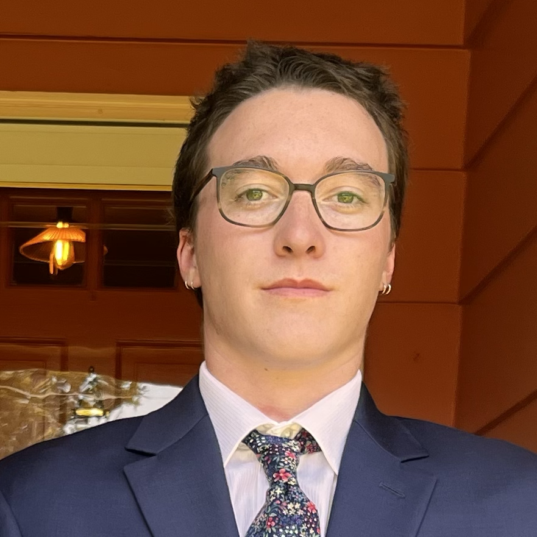
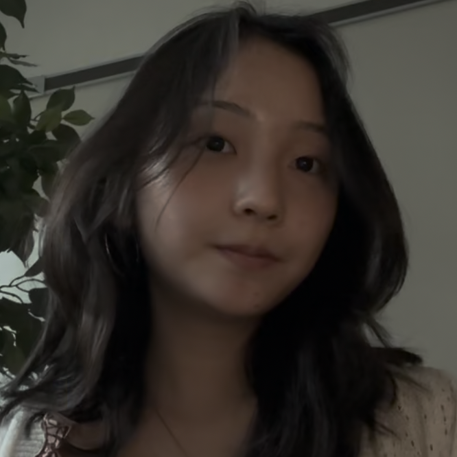

::: {layout="[[20,80]]"}
   Faculty Advisor](emily.jpeg)

I'm Emily. I am in my second year as a Visiting Assistant Professor of Statistics at Carleton College. I hold a PhD in Political Science and a Master's degree in Statistics, both from the University of Minnesota. I study American political economy, with a particular interest in work, environmental politics and policy, and political geography. I heavily utilize quantitative methods in my research, specifically data science and machine learning techniques.

My name is Ian Rock-Jones, I am from Burlington, VT and am a statistics major with a minor in digital arts and humanities. I am fascinated by data processing, collection, and analysis. Being able to problem-solve, visualize, and identify hidden relationships using data is incredibly fulfilling to me. Inspired by coursework about sampling techniques and advanced statistical modeling, I would like to pursue a career in complex survey design and sampling, ideally, in the public health sector. In my free time, I like to eat, climb and play frisbee.

Hello! My name is Rimona Zhang, I’m from New Jersey, and I am an undergraduate double majoring in Cognitive Science and Statistics at Carleton College. On campus I work as a peer leader for TRIO/Student Support Service and a tutor at the Quantitative Resource Center. I’m also involved in student groups like Lovelace and GeMMS. My interests are in data science and analysis—and prospectively in ML—since the process of cleaning data, uncovering patterns between variables, and using data to make predictions is both rewarding and valuable to me. The qualitative side of understanding contexts through numbers is another aspect I find interesting. Helping others make sense of ambiguous problems is what draws me to the intersectionality of quantitative and qualitative analysis—using both to convey clear, meaningful insights. In my spare time, some hobbies I enjoy include exploring new music genres (always open to recs!), cooking, junk journaling, and long walks.

   Sophomore](zoe.jpg)

I'm a student at Carleton College with academic interests in mathematics, computer science, statistics, and philosophy. During this project, I developed the Museum Explorer dashboard and conducted satellite-based analyses of cultural institutions across the United States, exploring how computational methods can transform large public datasets into interactive tools for research and public engagement. Looking ahead, I hope to pursue research at the intersection of mathematics, computer science, and artificial intelligence to build technologies that expand what people are able to do. I'm especially interested in creating human-centered tools that lower barriers to knowledge, opportunity, and participation, enabling people who face limitations in resources, access, or expertise to accomplish more.
:::
